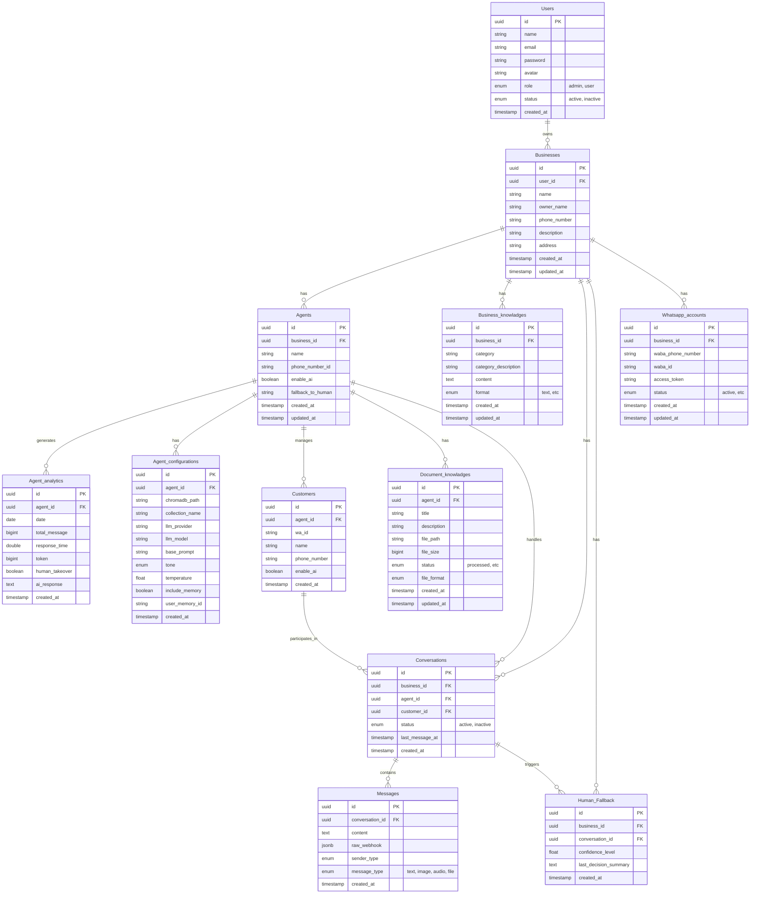

# Database Schema Documentation

This document describes the PostgreSQL database schema for the project, including table structures, relationships, and data types.
**Note**: All IDs and Key relationships use `UUID` (v4).

## Entity Relationship Diagram (ERD)

## Tables Detail

### Users
- `id`: UUID (PK, gen_random_uuid())
- `name`: text
- `email`: text
- `password`: text
- `avatar`: text (Optional)
- `role`: USER-DEFINED (default 'user')
- `status`: USER-DEFINED (default 'active')

### Businesses
- `id`: UUID (PK, gen_random_uuid())
- `user_id`: UUID (FK -> Users.id)
- `name`: text
- `owner_name`: text (Optional)
- `phone_number`: text
- `description`: text
- `address`: text

### Agents
- `id`: UUID (PK)
- `business_id`: UUID (FK -> Businesses.id)
- `name`: text
- `phone_number_id`: text (Unique)
- `enable_ai`: boolean (default true)
- `fallback_to_human`: text

### Agent_configurations
- `id`: UUID (PK, gen_random_uuid())
- `agent_id`: UUID (FK -> Agents.id)
- `llm_provider`: text
- `llm_model`: text
- `tone`: USER-DEFINED
- `temperature`: real (default 0.7)

### Agent_analytics
- `id`: UUID (PK, gen_random_uuid())
- `agent_id`: UUID (FK -> Agents.id)
- `date`: date
- `total_message`: bigint
- `response_time`: double precision
- `token`: bigint
- `human_takeover`: boolean
- `ai_response`: text

### Customers
- `id`: UUID (PK, gen_random_uuid())
- `agent_id`: UUID (FK -> Agents.id)
- `phone_number`: text
- `wa_id`: text
- `name`: text (Optional)
- `enable_ai`: boolean (default true)

### Conversations
- `id`: UUID (PK, gen_random_uuid())
- `business_id`: UUID (FK -> Businesses.id)
- `agent_id`: UUID (FK -> Agents.id)
- `customer_id`: UUID (FK -> Customers.id)
- `status`: USER-DEFINED (default 'active')
- `last_message_at`: timestamp

### Messages
- `id`: UUID (PK, gen_random_uuid())
- `conversation_id`: UUID (FK -> Conversations.id)
- `content`: text
- `sender_type`: USER-DEFINED
- `message_type`: USER-DEFINED (default 'text')
- `raw_webhook`: jsonb
- `created_at`: timestamp

### Business_knowladges
- `id`: UUID (PK, gen_random_uuid())
- `business_id`: UUID (FK -> Businesses.id)
- `category`: text
- `category_description`: text
- `content`: text
- `format`: USER-DEFINED (default 'text')

### Document_knowladges
- `id`: UUID (PK, gen_random_uuid())
- `agent_id`: UUID (FK -> Agents.id)
- `title`: text
- `description`: text
- `file_path`: text
- `status`: USER-DEFINED (default 'processed')

### Human_Fallback
- `id`: UUID (PK, gen_random_uuid())
- `business_id`: UUID (FK -> Businesses.id)
- `conversation_id`: UUID (FK -> Conversations.id)
- `confidence_level`: double precision
- `last_decision_summary`: text

### Whatsapp_accounts
- `id`: UUID (PK, gen_random_uuid())
- `business_id`: UUID (FK -> Businesses.id presumably)
- `waba_phone_number`: text
- `waba_id`: text
- `access_token`: text
- `status`: USER-DEFINED (default 'active')
